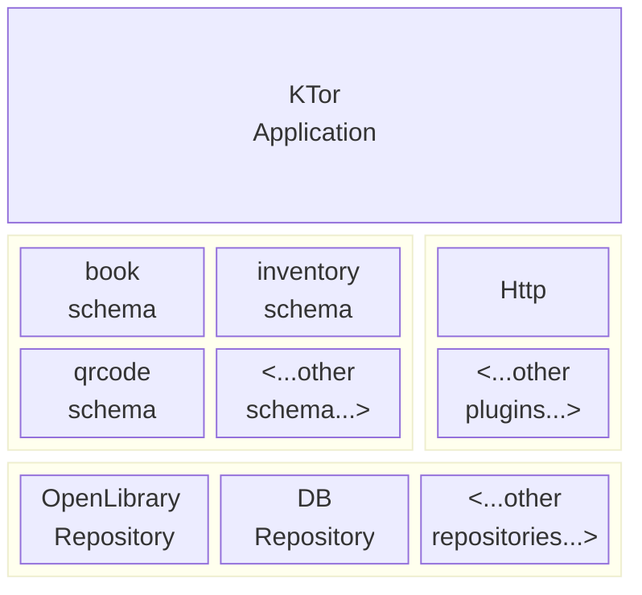

# Architecture

```mermaid
block-beta
  columns 3
  KTor\nApplication:3
  block:group1:2
    columns 2
    book\nschema
    inventory\nschema
    qrcode\nschema
    &lt;...other\nschema...&gt;
  end
  block:group2:1
    columns 1
    Http
    &lt;...other\nplugins...&gt;
  end
  block:group3:3
    %% columns auto (default)
    OpenLibrary&nbsp;\nRepository
    DB\nRepository
    &lt;...other\nrepositories...&gt;
  end
```